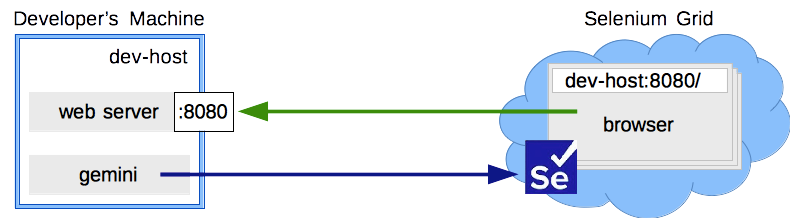
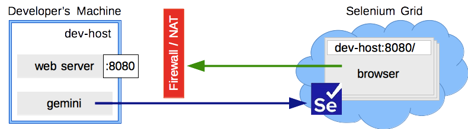
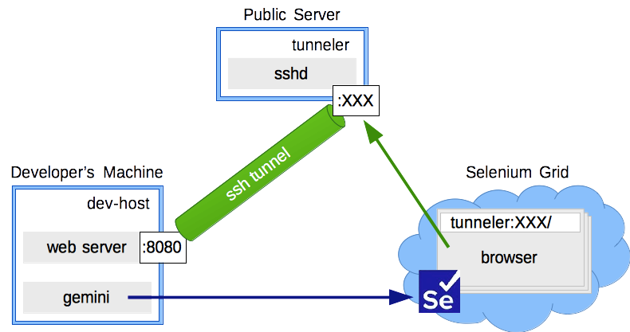
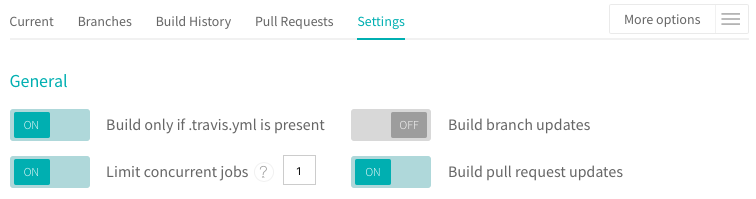
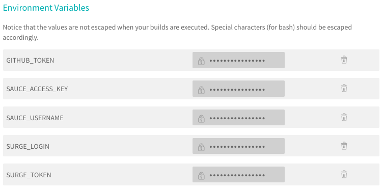

# Пример внедрения gemini в [TodoMVC](https://github.com/tastejs/todomvc)

Тестирование вёрстки gemini-тестами позволяет быть уверенными, что внесение изменений в код проекта не сломает вёрстку в любой части этого проекта.

## Локальный запуск тестов

1. Первый тест
   - устанавливаем и запускаем [Selenium](http://docs.seleniumhq.org/download/)
     ```sh
     npm install -g selenium-standalone
     selenium-standalone install
     ```
     в отдельном терминале запускаем Selenium-сервер, он понадобится на протяжении этапа локального запуска тестов
     ```sh
     selenium-standalone start
     ```
   - устанавливаем [gemini](https://github.com/gemini-testing/gemini) в проект
     ```sh
     npm install --save-dev gemini
     ```
   - устанавливаем и запускаем http-сервер, он понадобится только на этом шаге
     ```sh
     npm install http-server
     ```
     в отдельном терминале запускаем http-server
     ```sh
     http-server
     ```
     тестируемая страница [http://127.0.0.1:8080/](http://127.0.0.1:8080/)
   - запуск gemini в режиме сохранения эталонных изображений
     ```sh
     gemini update test/gemini/suites/todomvc.gemini.js
     ```
   - запуск gemini в режиме тестирования
     ```sh
     gemini test test/gemini/suites/todomvc.gemini.js
     ```
2. HTML-отчет о прохождении тестов
   - установка плагина [html-reporter](https://github.com/gemini-testing/html-reporter)
     ```sh
     npm install --save-dev html-reporter
     ```
   - но есть и другие виды отчетов, которые устанавливаются как плагины:
     - [stat-reporter](https://github.com/gemini-testing/stat-reporter) — отчет с агрегированной статистикой по браузерам
     - [json-reporter](https://github.com/gemini-testing/json-reporter) — JSON-отчет для интеграции в пользовательские среды CI
     - [gemini-teamcity](https://github.com/gemini-testing/gemini-teamcity) — отчет для интеграции с TeamCity
3. Модульные тесты на вёрстку
   - каждый тестируемый объект разбивается на минимальные элементы, которые могут принимать различные визуальные состояния в зависимости от производимых над ними действий
4. Статические данные для страницы
   - ограничения тестирования на живом API сервиса:
     - внешний вид тестируемой HTML-страницы зависит от данных
     - каждый `suit()` может выполняться параллельно в отдельном окне браузера, тесты могут изменять данные в произвольном порядке
     - обнуление данных перед или после теста делает невозможным использование параллельности выполнения тестов
   - подмена API сервиса статическими данными
     - устанавливаем [json-server](https://github.com/typicode/json-server/)
       ```sh
       npm install json-server
       ```
     - запускаем http-сервер с подменой API сервиса `/api/todos`
       ```sh
       json-server db.json --port 8080 --routes routes.json --static . --read-only
       ```
5. Ограничения локального запуска
   - зависимость тестов от внешнего окружения — частично решается за счет [retry](https://github.com/gemini-testing/gemini/blob/master/doc/config.md#browsers-settings)
   - тяжело поддерживать одинаковое окружение для разных разработчиков (ОС, версии браузеров, размер экрана)
   - нет возможности параллельного запуска тестов в браузерах на различных платформах
   - неудовлетворительная скорость при большом количестве тестов
   - сложно автоматизировать запуск браузеров на той же машине, где запускаются тесты

## Запуск тестов в Selenium облаке

0. Подключение к Selenium Grid
   - схема запуска тестов с Seleium Grid
     - в идеальном мире браузер в Seleium Grid может открыть страницу с http-сервера, запущенного на машине разработчика
       
     - но в реальном мире машина разработчика находится за Firewall или NAT
       
     - в таком случае поможет сервер со статическим адресом и [беспарольным доступом](http://www.thegeekstuff.com/2008/11/3-steps-to-perform-ssh-login-without-password-using-ssh-keygen-ssh-copy-id/) по ssh
       
       1. поднимается тоннель между машиной разработчика и сервером, через тоннель пробрасывается порт http-сервера с машины разработчика на свободный порт сервера
       1. браузеру передается хост и порт сервера в качестве хоста тестируемой страницы
   - если вы используете собственный Seleium Grid, то для организации описанной выше схемы можно использовать gemini-плагин [ssh-tunneler](https://github.com/gemini-testing/ssh-tunneler)
6. Запуск тестов в [SauceLabs](https://saucelabs.com)
   - для организации тоннеля с SauceLabs, устанавливаем [Sauce Connect Proxy](https://wiki.saucelabs.com/display/DOCS/Sauce+Connect+Proxy)
   - запускаем Sauce Connect Proxy
     ```sh
     export SAUCE_USERNAME=xxxxxx
     export SAUCE_ACCESS_KEY=yyyyyyyy-yyyy-yyyy-yyyy-yyyyyyyyyyyy
     path/to/sc
     ```
   - подобрать `desiredCapabilities` необходимых браузеров можно с помощью [Platform Configurator](https://wiki.saucelabs.com/display/DOCS/Platform+Configurator#/)
   - gemini-плагин [gemini-saucelabs-info](https://github.com/gemini-testing/gemini-saucelabs-info) поможет авторизоваться в SauceLabs без передачи дополнительных параметров
     ```sh
     npm install --save-dev gemini-saucelabs-info
     ```
   - запуск gemini в режиме обновления скриншотов
     ```sh
     gemini_grid_url="http://ondemand.saucelabs.com/wd/hub" gemini update -b desktop-firefox test/gemini/suites/todomvc.gemini.js
     ```
     и запуска тестов в SauceLabs
     ```sh
     gemini_grid_url="http://ondemand.saucelabs.com/wd/hub" gemini test -b desktop-firefox test/gemini/suites/todomvc.gemini.js
     ```

## Автоматизация 

7. Сокращенные команды
   - секция конфигурации [sets](https://github.com/gemini-testing/gemini/blob/master/doc/config.md#sets) позволяет настроить различные варианты запуска тестов
   - разделим конфигурацию для запуска тестов в локальном Selenium и SauceLabs
     - запуск тестов локально
     ```sh
     gemini test -s local
     ```
     и запуска тестов в SauceLabs
     ```sh
     gemini_grid_url="http://ondemand.saucelabs.com/wd/hub" gemini test -s sauce
     ```
   - длинные команды спрячем в npm run-скрипт
     ```sh
     npm run gemini-local
     npm run gemini-local-update
     npm run gemini-sauce
     npm run gemini-sauce-update
     ```
8. Автоматический запуск web-сервера из gemini
   - gemini расширяется [плагинами](https://github.com/gemini-testing/gemini/blob/master/doc/plugins.md), в которых можно задать пользовательские команды, подписанные на [события gemini](https://github.com/gemini-testing/gemini/blob/master/doc/programmatic-api.md#events)
   - пример плагина [gemini-json-server](https://github.com/levonet/gemini-json-server) для автоматический запуск сервера разработки
   ```sh
   npm install --save-dev git+https://github.com/levonet/gemini-json-server.git
   ```
   - другие плагины, запускающие web-сервера во время запуска тестов:
     - [gemini-ecstatic](https://github.com/w0rm/gemini-ecstatic) — сервер статики
     - [gemini-express](https://github.com/Saulis/gemini-express) — запуск express
     - [gemini-react](https://github.com/researchgate/gemini-react) — плагин для тестирования react компонент
9. Оптимизация и хранение изображений
   - плагин оптимизации изображений [gemini-optipng](https://github.com/gemini-testing/gemini-optipng)
     ```sh
     npm install --save-dev gemini-optipng
     ```
   - Git Large File Storage
     1. устанавливаем [git-lfs](https://git-lfs.github.com) согласно инструкций
     2. инициализируем маску пути, по которой будем хранить изображения
        ```sh
        git lfs track test/gemini/references/**/*.png
        ```
     3. коммитим изображения
10. Запуск gemini в [Travis CI](travis-ci.com)
   - запуск тестов в браузерах — дорогая операция, по этому будем их запускать только для Pull Requests
   - SauceLabs ограничивает нас одним запуском тоннеля на одного пользователя, по этому устанавливаем [лимит на количество параллельных сборок](https://docs.travis-ci.com/user/customizing-the-build/#Limiting-Concurrent-Builds) в `1`
     
   - публикации gemini html-отчета в Pull Request
     - для публикации отчетов воспользуемся [surge.sh](https://surge.sh)
     - для публикации комментария со ссылками на отчеты понадобится [github token](https://help.github.com/articles/creating-a-personal-access-token-for-the-command-line/) на репозиторий
   - все необходимые ключи и токены для авторизации добавляем в переменные среды окружения Travis CI
     

## Оптимизация и сахар

11. Настройка параллельности
  - по браузерам — работает по умолчанию
  - по сессиям — устанавливается опцией `sessionsPerBrowser`. Её можно задать для каждого браузера в отдельности
  - ограничение на общее одновременно открытие сессий задается опцией `parallelLimit`. Это необходимо для работы с облачными сервисами предоставляющими доступ к браузерам
  - ограничение на количество запущенных тестов для одной сессии `suitesPerSession`, при превышении этого ограничения старая сессия закрывается и открывается новая. Это ограничение можно задавать для каждого браузера в отдельности
12. Отчет о покрытии CSS тестами
   - gemini умеет строит отчет о покрытии CSS тестами, для этого нужно подключить утилиту для генерации HTML-отчета [gemini-coverage](https://github.com/gemini-testing/gemini-coverage)
     ```sh
     npm install --save-dev gemini-coverage
     ```
13. GUI для запуска тестов и сохранения эталонов
   - [gemini-gui](https://github.com/gemini-testing/gemini-gui) можно установить глобально
     ```sh
     npm install -g gemini-gui
     ```
   - запускается gemini-gui в рабочей копии проекта, при необходимости можно использовать те же аргументы что и для `gemini`, но без команд `test` и `update`
     ```sh
     gemini-gui
     ```

# AngularJS TodoMVC Example

> HTML is great for declaring static documents, but it falters when we try to use it for declaring dynamic views in web-applications. AngularJS lets you extend HTML vocabulary for your application. The resulting environment is extraordinarily expressive, readable, and quick to develop.

> _[AngularJS - angularjs.org](http://angularjs.org)_


## Learning AngularJS
The [AngularJS website](http://angularjs.org) is a great resource for getting started.

Here are some links you may find helpful:

* [Tutorial](http://docs.angularjs.org/tutorial)
* [API Reference](http://docs.angularjs.org/api)
* [Developer Guide](http://docs.angularjs.org/guide)
* [Applications built with AngularJS](https://www.madewithangular.com/)
* [Blog](http://blog.angularjs.org)
* [FAQ](http://docs.angularjs.org/misc/faq)
* [AngularJS Meetups](http://www.youtube.com/angularjs)

Articles and guides from the community:

* [Code School AngularJS course](https://www.codeschool.com/courses/shaping-up-with-angular-js)
* [5 Awesome AngularJS Features](http://net.tutsplus.com/tutorials/javascript-ajax/5-awesome-angularjs-features)
* [Using Yeoman with AngularJS](http://briantford.com/blog/angular-yeoman.html)
* [me&ngular - an introduction to MVW](http://stephenplusplus.github.io/meangular)

Get help from other AngularJS users:

* [Walkthroughs and Tutorials on YouTube](http://www.youtube.com/playlist?list=PL1w1q3fL4pmgqpzb-XhG7Clgi67d_OHXz)
* [Google Groups mailing list](https://groups.google.com/forum/?fromgroups#!forum/angular)
* [angularjs on Stack Overflow](http://stackoverflow.com/questions/tagged/angularjs)
* [AngularJS on Twitter](https://twitter.com/angularjs)
* [AngularjS on Google +](https://plus.google.com/+AngularJS/posts)

_If you have other helpful links to share, or find any of the links above no longer work, please [let us know](https://github.com/tastejs/todomvc/issues)._

## Testsuite

The app uses [Karma](http://karma-runner.github.io/0.12/index.html) to run the tests located in the `test/` folder. To run the tests:

```
$ npm install
$ npm test
```
